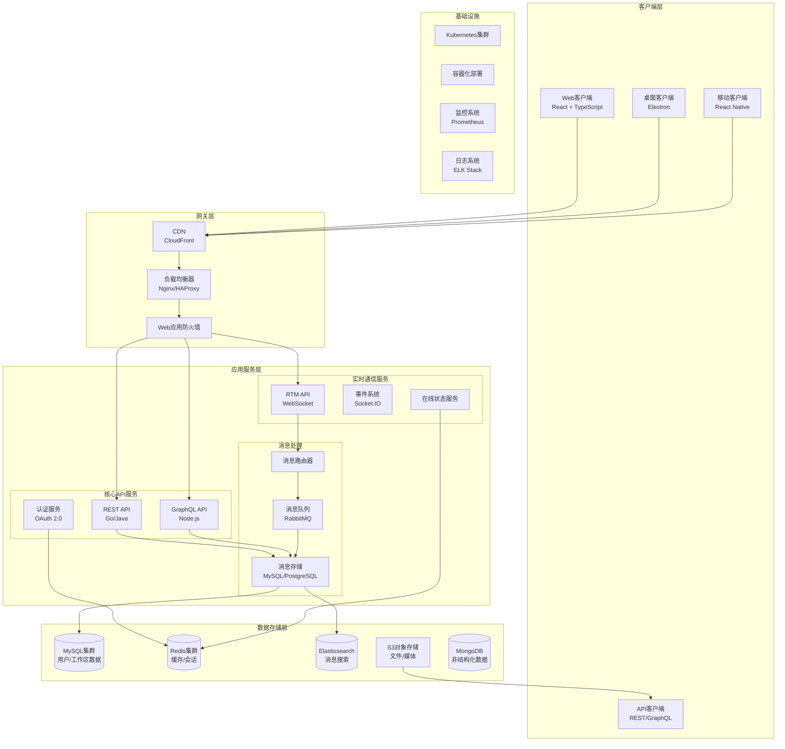
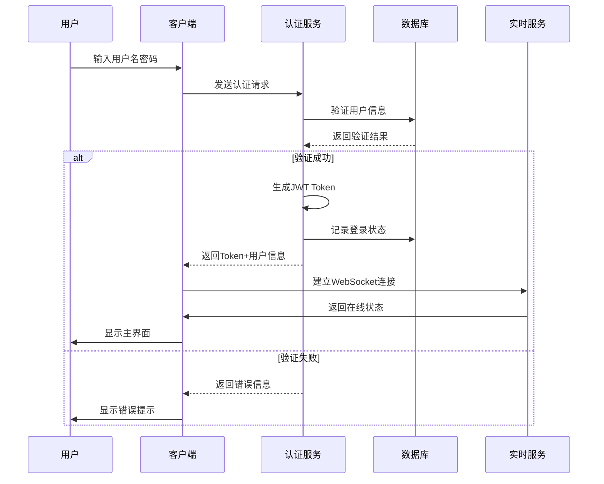
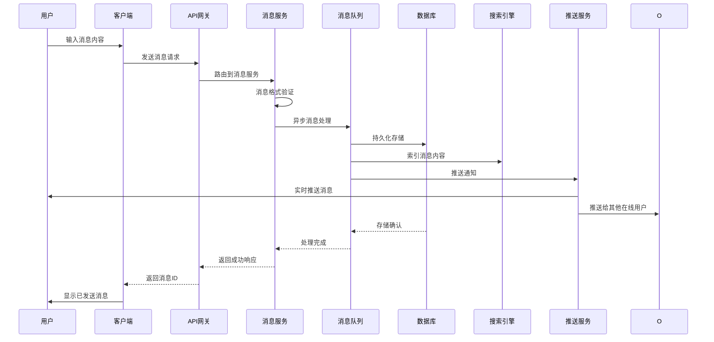
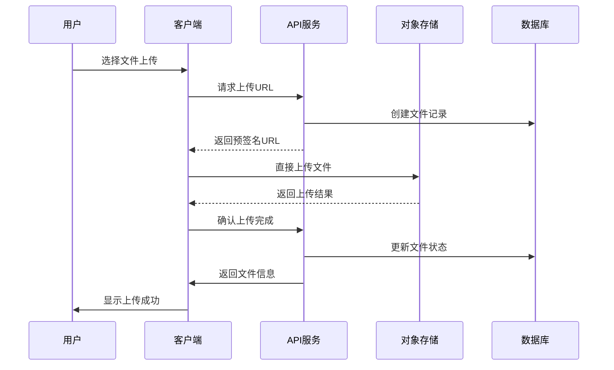

# Slack 项目架构与功能设计分析

## 项目概述

Slack 是一个企业级团队协作平台，集成了即时通讯、文件共享、应用集成和工作流程自动化等功能。本文档深入分析 Slack 的整体架构设计和核心功能模块。

## 系统架构图

## 核心功能模块

### 1. 消息系统
- **实时消息传输**: WebSocket 长连接
- **消息同步**: 多设备消息同步机制
- **消息存储**: 分层存储策略（热数据/冷数据）
- **消息搜索**: Elasticsearch 全文检索

### 2. 用户管理
- **身份认证**: OAuth 2.0 + SSO 集成
- **权限控制**: 基于角色的访问控制(RBAC)
- **用户组管理**: 工作区-频道-用户三级结构

### 3. 文件系统
- **文件上传**: 分片上传 + 断点续传
- **文件存储**: AWS S3 对象存储
- **文件预览**: 多格式支持(PDF/图片/视频)
- **版本控制**: 文件历史版本管理

### 4. 集成平台
- **应用市场**: 第三方应用集成
- **Bot框架**: 自定义机器人开发
- **Webhook**: 外部系统事件通知
- **API网关**: 统一接口管理

## 操作流程图

### 用户登录流程

### 消息发送流程

### 文件上传流程

## 技术栈详解

### 前端技术栈
- **Web端**: React + TypeScript + Webpack
- **桌面端**: Electron + React
- **移动端**: React Native
- **状态管理**: Redux Toolkit + RTK Query
- **UI框架**: Slack Kit + 自定义组件库

### 后端技术栈
- **API服务**: Go (高性能API) + Java (业务逻辑)
- **实时通信**: Node.js + Socket.IO
- **消息队列**: RabbitMQ + Redis Streams
- **数据库**: MySQL (主从) + PostgreSQL (分析)
- **缓存**: Redis Cluster
- **搜索**: Elasticsearch + Kibana

### 基础设施
- **容器化**: Docker + Kubernetes
- **服务网格**: Istio
- **监控**: Prometheus + Grafana
- **日志**: ELK Stack (Elasticsearch + Logstash + Kibana)
- **CI/CD**: Jenkins + ArgoCD

## 性能优化策略

### 1. 消息传输优化
- **WebSocket连接池**: 复用连接减少开销
- **消息压缩**: 使用gzip压缩减少传输数据量
- **增量同步**: 只传输变更数据
- **本地缓存**: IndexedDB存储历史消息

### 2. 图片和媒体优化
- **懒加载**: 视口内图片才加载
- **多分辨率**: 根据设备提供不同尺寸
- **CDN分发**: 全球加速访问
- **格式优化**: WebP格式减少体积

### 3. 数据库优化
- **读写分离**: 主从数据库架构
- **分库分表**: 按工作区分片
- **缓存预热**: 热点数据预加载
- **索引优化**: 复合索引提升查询效率

## 安全架构

### 1. 认证与授权
- **多因子认证**: 支持TOTP/SMS/邮件
- **单点登录**: SAML 2.0/OAuth 2.0
- **权限继承**: 工作区→频道→消息三级权限
- **审计日志**: 完整的操作记录

### 2. 数据安全
- **传输加密**: TLS 1.3全链路加密
- **存储加密**: AES-256数据库加密
- **密钥管理**: AWS KMS密钥轮换
- **数据脱敏**: 敏感信息自动脱敏

### 3. 网络安全
- **DDoS防护**: CloudFlare防护
- **WAF规则**: OWASP Top 10防护
- **API限流**: 基于用户/IP的限流
- **CSP策略**: 防止XSS攻击

## 扩展性设计

### 1. 微服务架构
- **服务拆分**: 按业务域垂直拆分
- **API网关**: 统一入口和路由
- **服务发现**: Consul + Kubernetes DNS
- **配置中心**: 动态配置管理

### 2. 水平扩展
- **无状态服务**: 服务无状态设计
- **负载均衡**: 多层负载均衡策略
- **自动伸缩**: 基于CPU/内存的HPA
- **数据库扩展**: 读写分离+分库分表

### 3. 多租户架构
- **数据隔离**: 工作区级别的数据隔离
- **资源隔离**: 独立的计算和存储资源
- **性能隔离**: 防止租户间资源争抢
- **计费系统**: 基于使用量的计费模型

## 部署架构

### 1. 多环境部署
- **开发环境**: 单实例快速迭代
- **测试环境**: 完整功能测试
- **预生产**: 生产数据子集验证
- **生产环境**: 多可用区高可用

### 2. 灾备策略
- **异地多活**: 多区域部署
- **数据备份**: 实时备份+定期快照
- **故障转移**: 自动故障检测和切换
- **数据恢复**: RPO<1分钟, RTO<5分钟

## 总结

Slack 的架构设计体现了现代云原生应用的最佳实践，通过微服务、容器化、DevOps等技术实现了高可用、高性能、可扩展的企业级协作平台。其分层架构设计不仅保证了系统的稳定性，也为未来的功能扩展和技术演进提供了良好的基础。
