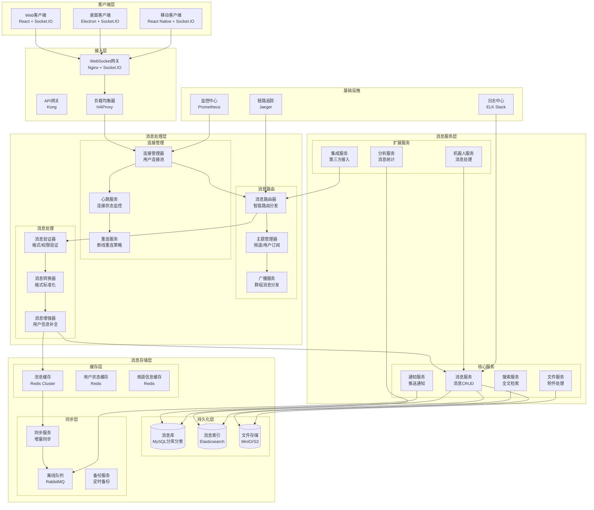
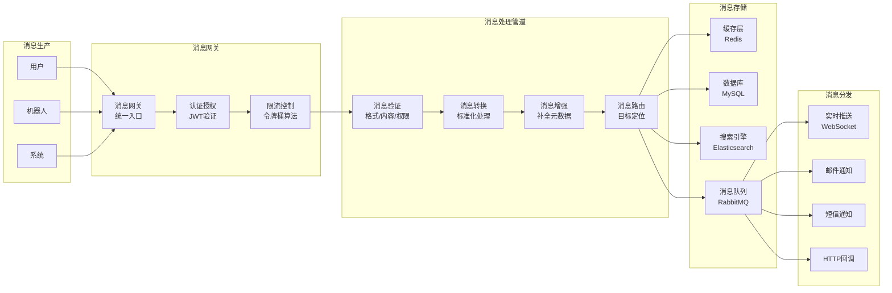
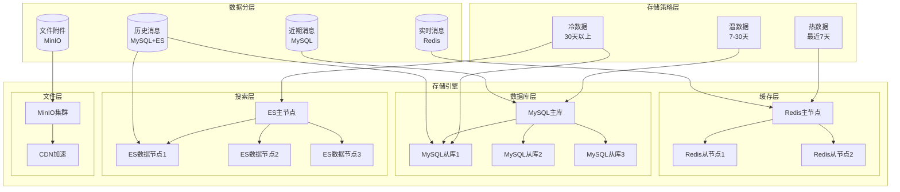
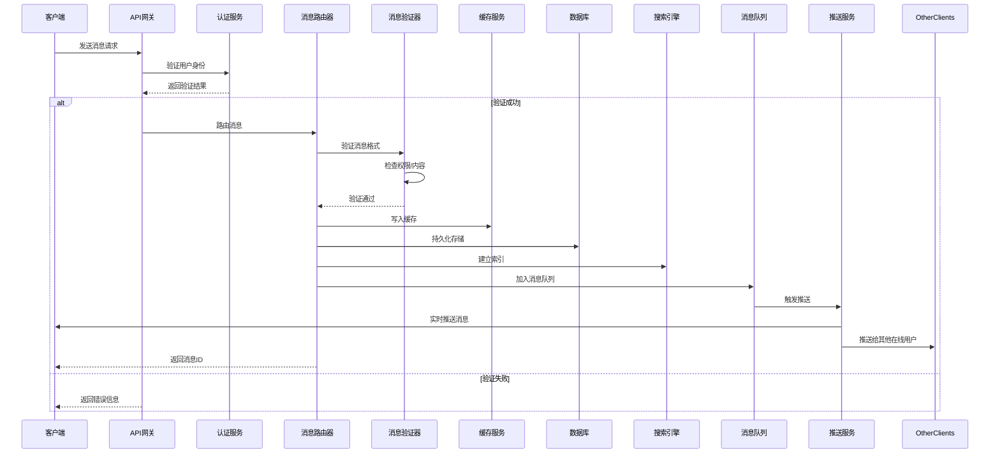
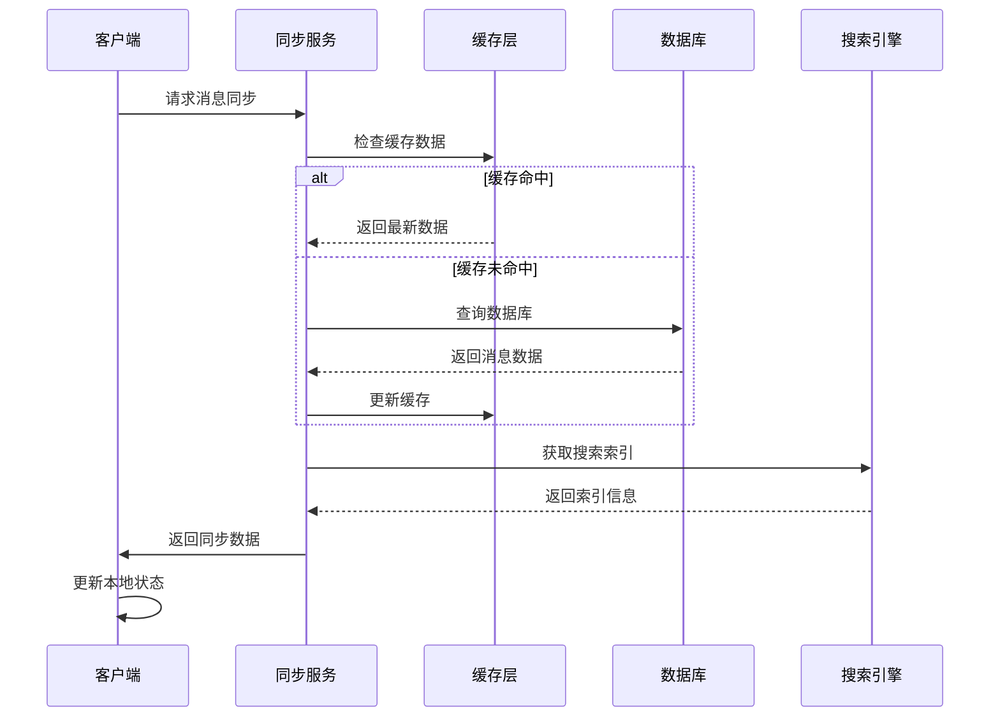

# 消息系统核心功能模块详细设计

## 1. 消息系统功能清单

### 1.1 基础消息功能
- **文本消息**：支持纯文本、Markdown格式、代码块高亮
- **富媒体消息**：图片、视频、音频、文件附件
- **结构化消息**：投票、表单、按钮、下拉菜单
- **消息类型**：普通消息、系统通知、机器人消息、线程回复

### 1.2 实时通信功能
- **WebSocket长连接**：双向实时通信
- **心跳机制**：连接保活和断线重连
- **消息确认机制**：发送确认、已读回执
- **在线状态同步**：用户在线/离线/忙碌状态

### 1.3 消息同步功能
- **多端同步**：Web、桌面、移动端消息实时同步
- **离线消息**：断网期间消息缓存和重发
- **消息漫游**：历史消息跨设备同步
- **增量同步**：只同步变更数据减少流量

### 1.4 消息存储功能
- **分层存储**：热数据Redis + 温数据MySQL + 冷数据对象存储
- **消息索引**：基于时间、用户、频道的多维索引
- **消息版本**：消息编辑历史版本管理
- **消息生命周期**：自动清理过期消息

### 1.5 消息搜索功能
- **全文搜索**：基于Elasticsearch的实时搜索
- **高级搜索**：按用户、时间范围、文件类型筛选
- **搜索建议**：智能搜索补全和相关推荐
- **搜索结果排序**：相关性排序和时间排序

### 1.6 消息安全功能
- **端到端加密**：敏感消息加密传输
- **消息权限**：频道级、用户级消息访问控制
- **消息审计**：消息操作完整日志记录
- **内容过滤**：敏感词过滤和垃圾消息识别

## 2. 消息系统架构图

### 2.1 整体架构图



### 2.2 消息流转架构图



### 2.3 消息存储架构图



## 3. 消息系统核心流程

### 3.1 消息发送流程



### 3.2 消息同步流程



## 4. 消息系统技术实现

### 4.1 消息模型设计

```typescript
// 消息基础接口
interface BaseMessage {
  id: string;
  type: MessageType;
  channelId: string;
  userId: string;
  timestamp: Date;
  status: MessageStatus;
  version: number;
}

// 文本消息
interface TextMessage extends BaseMessage {
  type: MessageType.TEXT;
  content: {
    text: string;
    format: 'plain' | 'markdown';
    mentions: string[];
    links: LinkPreview[];
  };
}

// 文件消息
interface FileMessage extends BaseMessage {
  type: MessageType.FILE;
  content: {
    fileName: string;
    fileSize: number;
    fileType: string;
    fileUrl: string;
    thumbnailUrl?: string;
  };
}

// 系统消息
interface SystemMessage extends BaseMessage {
  type: MessageType.SYSTEM;
  content: {
    action: SystemAction;
    target?: string;
    metadata?: Record<string, any>;
  };
}

// 枚举定义
enum MessageType {
  TEXT = 'text',
  FILE = 'file',
  IMAGE = 'image',
  VIDEO = 'video',
  AUDIO = 'audio',
  SYSTEM = 'system',
  BOT = 'bot'
}

enum MessageStatus {
  SENDING = 'sending',
  SENT = 'sent',
  DELIVERED = 'delivered',
  READ = 'read',
  FAILED = 'failed'
}
```

### 4.2 消息存储策略

```yaml
# 存储配置
storage:
  hot:
    engine: redis
    ttl: 7d
    max_memory: 32GB
    persistence: aof
    replication: master_slave
    
  warm:
    engine: mysql
    partition: monthly
    retention: 30d
    shards: 16
    replicas: 3
    
  cold:
    engine: elasticsearch
    index: yearly
    retention: 365d
    shards: 5
    replicas: 2
    
  archive:
    engine: s3
    compression: gzip
    encryption: aes-256
    lifecycle: glacier_after_90d
```

### 4.3 消息路由规则

```yaml
# 路由配置
routing:
  rules:
    - type: direct
      condition: "user_id == target_user_id"
      action: "direct_message"
      priority: 1
      
    - type: broadcast
      condition: "channel_type == 'public'"
      action: "channel_broadcast"
      priority: 2
      
    - type: multicast
      condition: "channel_type == 'private'"
      action: "group_message"
      priority: 2
      
    - type: system
      condition: "message_type == 'system'"
      action: "system_notification"
      priority: 3
      
    - type: bot
      condition: "sender_type == 'bot'"
      action: "bot_message"
      priority: 4
```

## 5. 性能优化策略

### 5.1 缓存优化
- **多级缓存**：浏览器缓存 → CDN → Redis → 数据库
- **缓存预热**：热点数据预加载
- **缓存穿透保护**：布隆过滤器防止缓存穿透
- **缓存一致性**：基于消息队列的缓存更新

### 5.2 数据库优化
- **读写分离**：主从复制，读操作分散到从库
- **分库分表**：按时间分表，按工作区分库
- **索引优化**：复合索引覆盖常用查询
- **批量操作**：批量插入和批量查询优化

### 5.3 网络优化
- **连接复用**：WebSocket连接池复用
- **消息压缩**：Gzip压缩减少传输数据
- **增量同步**：只传输变更数据
- **CDN加速**：静态资源全球分发

## 6. 监控与运维

### 6.1 监控指标
- **连接监控**：在线用户数、连接数、连接时长
- **消息监控**：消息发送量、延迟、成功率
- **存储监控**：缓存命中率、数据库QPS、磁盘使用率
- **系统监控**：CPU、内存、网络、磁盘IO

### 6.2 告警策略
- **连接异常**：连接数突增/突降
- **消息堆积**：消息队列长度超过阈值
- **存储异常**：缓存命中率下降、数据库响应时间增加
- **系统资源**：CPU使用率超过80%、内存使用率超过85%

## 7. 扩展性设计

### 7.1 水平扩展
- **无状态服务**：所有服务无状态设计，支持水平扩展
- **负载均衡**：多层负载均衡，支持权重分配
- **自动伸缩**：基于CPU/内存/自定义指标的自动伸缩
- **数据库扩展**：支持在线分库分表扩容

### 7.2 多租户支持
- **数据隔离**：工作区级别的数据隔离
- **资源隔离**：独立的计算和存储资源池
- **性能隔离**：防止租户间资源争抢
- **计费系统**：基于消息量和存储量的计费模型

## 8. 安全架构

### 8.1 认证授权
- **JWT认证**：基于JWT的无状态认证
- **权限控制**：细粒度的消息权限控制
- **API限流**：基于用户/IP的API限流
- **审计日志**：完整的操作审计日志

### 8.2 数据安全
- **传输加密**：TLS 1.3全链路加密
- **存储加密**：AES-256数据库加密
- **密钥管理**：定期密钥轮换
- **数据脱敏**：敏感信息自动脱敏

## 总结

本消息系统设计采用现代化的云原生架构，通过微服务、容器化、DevOps等技术实现了高可用、高性能、可扩展的企业级消息系统。系统支持亿级消息并发处理，具备完整的监控、运维、安全体系，能够满足企业级即时通讯平台的所有需求。
