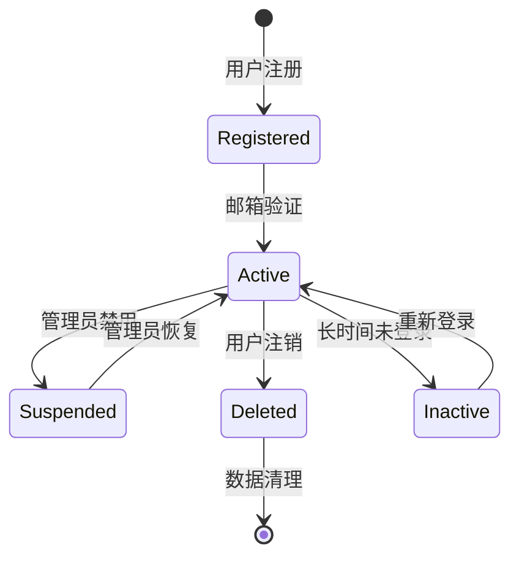
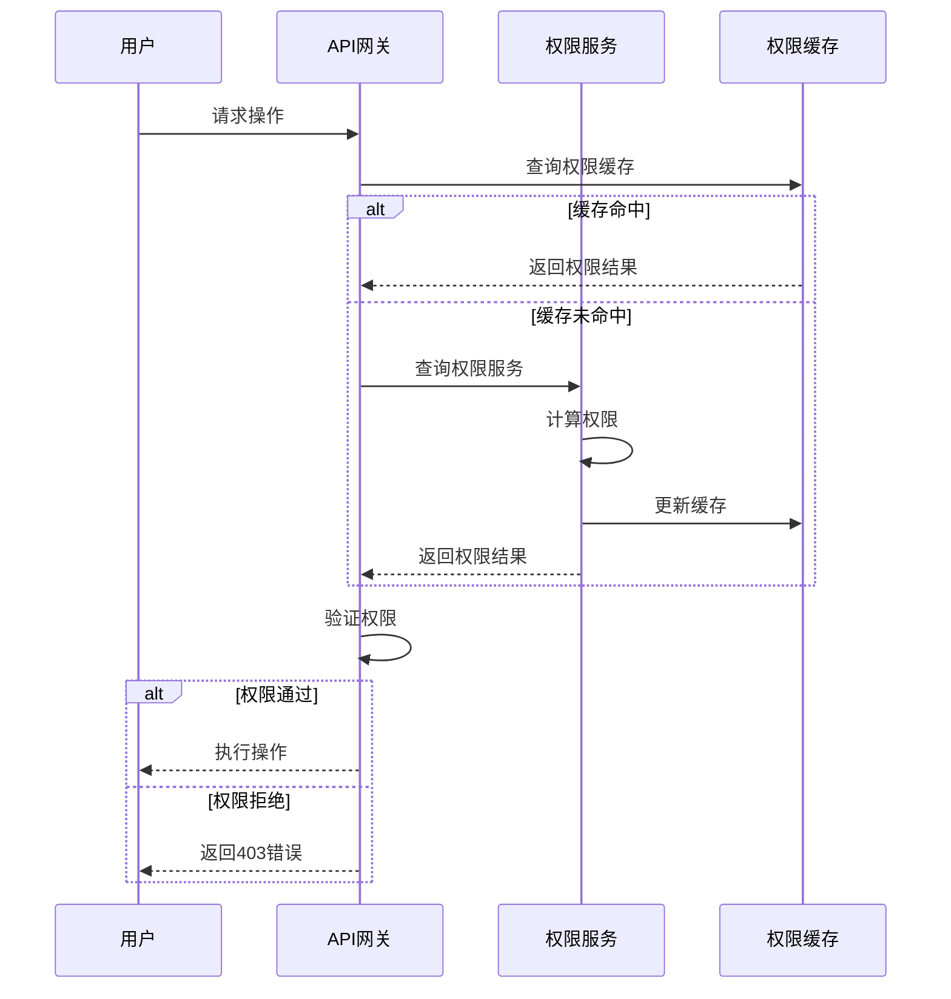

# 用户管理设计文档

## 1. 用户表设计

### 1.1 核心用户表结构

#### 用户基础信息表 (users)
```sql
CREATE TABLE users (
    id BIGINT PRIMARY KEY AUTO_INCREMENT,
    user_id VARCHAR(36) UNIQUE NOT NULL COMMENT '全局唯一用户ID',
    username VARCHAR(50) UNIQUE NOT NULL COMMENT '用户名',
    email VARCHAR(255) UNIQUE NOT NULL COMMENT '邮箱地址',
    phone VARCHAR(20) COMMENT '手机号',
    password_hash VARCHAR(255) NOT NULL COMMENT '密码哈希',
    salt VARCHAR(32) NOT NULL COMMENT '密码盐值',
    
    -- 用户状态
    status TINYINT DEFAULT 1 COMMENT '1-正常 2-禁用 3-未激活 4-已删除',
    account_type TINYINT DEFAULT 1 COMMENT '1-普通用户 2-管理员 3-超级管理员',
    
    -- 个人信息
    display_name VARCHAR(100) COMMENT '显示名称',
    avatar_url VARCHAR(500) COMMENT '头像URL',
    bio TEXT COMMENT '个人简介',
    timezone VARCHAR(50) DEFAULT 'UTC' COMMENT '时区',
    language VARCHAR(10) DEFAULT 'zh-CN' COMMENT '语言偏好',
    
    -- 安全相关
    email_verified BOOLEAN DEFAULT FALSE COMMENT '邮箱验证状态',
    phone_verified BOOLEAN DEFAULT FALSE COMMENT '手机验证状态',
    two_factor_enabled BOOLEAN DEFAULT FALSE COMMENT '双因子认证状态',
    last_login_at TIMESTAMP NULL COMMENT '最后登录时间',
    last_login_ip VARCHAR(45) COMMENT '最后登录IP',
    
    -- 审计字段
    created_at TIMESTAMP DEFAULT CURRENT_TIMESTAMP,
    updated_at TIMESTAMP DEFAULT CURRENT_TIMESTAMP ON UPDATE CURRENT_TIMESTAMP,
    deleted_at TIMESTAMP NULL COMMENT '软删除时间',
    
    INDEX idx_email (email),
    INDEX idx_username (username),
    INDEX idx_phone (phone),
    INDEX idx_status (status),
    INDEX idx_created_at (created_at)
) ENGINE=InnoDB DEFAULT CHARSET=utf8mb4 COLLATE=utf8mb4_unicode_ci;
```

#### 用户工作区关联表 (user_workspaces)
```sql
CREATE TABLE user_workspaces (
    id BIGINT PRIMARY KEY AUTO_INCREMENT,
    user_id VARCHAR(36) NOT NULL COMMENT '用户ID',
    workspace_id VARCHAR(36) NOT NULL COMMENT '工作区ID',
    
    -- 用户在工作区的角色
    role ENUM('owner', 'admin', 'member', 'guest') DEFAULT 'member',
    
    -- 用户在工作区的状态
    status ENUM('active', 'inactive', 'suspended', 'pending') DEFAULT 'pending',
    
    -- 权限设置
    permissions JSON COMMENT '自定义权限配置',
    
    -- 加入信息
    joined_at TIMESTAMP DEFAULT CURRENT_TIMESTAMP,
    invited_by VARCHAR(36) COMMENT '邀请人ID',
    
    -- 审计字段
    created_at TIMESTAMP DEFAULT CURRENT_TIMESTAMP,
    updated_at TIMESTAMP DEFAULT CURRENT_TIMESTAMP ON UPDATE CURRENT_TIMESTAMP,
    
    UNIQUE KEY uk_user_workspace (user_id, workspace_id),
    INDEX idx_workspace (workspace_id),
    INDEX idx_role (role),
    INDEX idx_status (status)
) ENGINE=InnoDB DEFAULT CHARSET=utf8mb4 COLLATE=utf8mb4_unicode_ci;
```

#### 用户设备表 (user_devices)
```sql
CREATE TABLE user_devices (
    id BIGINT PRIMARY KEY AUTO_INCREMENT,
    user_id VARCHAR(36) NOT NULL COMMENT '用户ID',
    device_id VARCHAR(64) NOT NULL COMMENT '设备唯一标识',
    
    -- 设备信息
    device_type ENUM('web', 'desktop', 'mobile', 'tablet') NOT NULL,
    device_name VARCHAR(100) COMMENT '设备名称',
    os_type VARCHAR(20) COMMENT '操作系统类型',
    os_version VARCHAR(20) COMMENT '操作系统版本',
    app_version VARCHAR(20) COMMENT '应用版本',
    
    -- 登录信息
    login_at TIMESTAMP DEFAULT CURRENT_TIMESTAMP,
    last_activity_at TIMESTAMP DEFAULT CURRENT_TIMESTAMP,
    ip_address VARCHAR(45) COMMENT 'IP地址',
    location VARCHAR(100) COMMENT '地理位置',
    
    -- 状态
    status ENUM('active', 'inactive', 'expired') DEFAULT 'active',
    
    -- Token信息
    refresh_token VARCHAR(255) COMMENT '刷新令牌',
    expires_at TIMESTAMP COMMENT '过期时间',
    
    created_at TIMESTAMP DEFAULT CURRENT_TIMESTAMP,
    updated_at TIMESTAMP DEFAULT CURRENT_TIMESTAMP ON UPDATE CURRENT_TIMESTAMP,
    
    UNIQUE KEY uk_user_device (user_id, device_id),
    INDEX idx_device_id (device_id),
    INDEX idx_status (status),
    INDEX idx_expires_at (expires_at)
) ENGINE=InnoDB DEFAULT CHARSET=utf8mb4 COLLATE=utf8mb4_unicode_ci;
```

#### 用户权限表 (user_permissions)
```sql
CREATE TABLE user_permissions (
    id BIGINT PRIMARY KEY AUTO_INCREMENT,
    user_id VARCHAR(36) NOT NULL COMMENT '用户ID',
    resource_type VARCHAR(50) NOT NULL COMMENT '资源类型(workspace/channel/message)',
    resource_id VARCHAR(36) NOT NULL COMMENT '资源ID',
    
    -- 权限定义
    permission_type VARCHAR(50) NOT NULL COMMENT '权限类型',
    permission_value JSON COMMENT '权限值',
    
    -- 权限来源
    granted_by VARCHAR(36) COMMENT '授权人ID',
    granted_at TIMESTAMP DEFAULT CURRENT_TIMESTAMP,
    expires_at TIMESTAMP NULL COMMENT '过期时间',
    
    created_at TIMESTAMP DEFAULT CURRENT_TIMESTAMP,
    
    INDEX idx_user_resource (user_id, resource_type, resource_id),
    INDEX idx_resource (resource_type, resource_id),
    INDEX idx_expires_at (expires_at)
) ENGINE=InnoDB DEFAULT CHARSET=utf8mb4 COLLATE=utf8mb4_unicode_ci;
```

### 1.2 用户配置表结构

#### 用户偏好设置表 (user_preferences)
```sql
CREATE TABLE user_preferences (
    id BIGINT PRIMARY KEY AUTO_INCREMENT,
    user_id VARCHAR(36) UNIQUE NOT NULL COMMENT '用户ID',
    
    -- 通知设置
    notification_settings JSON DEFAULT '{}' COMMENT '通知偏好设置',
    
    -- 界面设置
    theme ENUM('light', 'dark', 'auto') DEFAULT 'auto' COMMENT '主题偏好',
    sidebar_behavior ENUM('expanded', 'collapsed', 'auto') DEFAULT 'auto',
    message_display ENUM('compact', 'comfortable') DEFAULT 'comfortable',
    
    -- 隐私设置
    show_email BOOLEAN DEFAULT FALSE COMMENT '是否公开邮箱',
    show_phone BOOLEAN DEFAULT FALSE COMMENT '是否公开手机号',
    allow_direct_message BOOLEAN DEFAULT TRUE COMMENT '允许私信',
    
    -- 语言设置
    language VARCHAR(10) DEFAULT 'zh-CN',
    timezone VARCHAR(50) DEFAULT 'UTC',
    
    -- 自定义数据
    custom_data JSON DEFAULT '{}',
    
    created_at TIMESTAMP DEFAULT CURRENT_TIMESTAMP,
    updated_at TIMESTAMP DEFAULT CURRENT_TIMESTAMP ON UPDATE CURRENT_TIMESTAMP
) ENGINE=InnoDB DEFAULT CHARSET=utf8mb4 COLLATE=utf8mb4_unicode_ci;
```

## 2. 接口设计

### 2.1 RESTful API 接口规范

#### 用户认证接口

**用户注册**
```
POST /api/v1/auth/register
Content-Type: application/json

{
    "username": "string",
    "email": "string",
    "password": "string",
    "display_name": "string",
    "timezone": "string"
}

Response: 201 Created
{
    "user_id": "string",
    "username": "string",
    "email": "string",
    "display_name": "string",
    "created_at": "timestamp"
}
```

**用户登录**
```
POST /api/v1/auth/login
Content-Type: application/json

{
    "login": "string",  // username or email
    "password": "string",
    "device_info": {
        "device_type": "web|desktop|mobile",
        "device_name": "string",
        "os_type": "string",
        "app_version": "string"
    }
}

Response: 200 OK
{
    "access_token": "string",
    "refresh_token": "string",
    "expires_in": 3600,
    "user": {
        "user_id": "string",
        "username": "string",
        "email": "string",
        "display_name": "string",
        "avatar_url": "string"
    }
}
```

**刷新Token**
```
POST /api/v1/auth/refresh
Content-Type: application/json

{
    "refresh_token": "string"
}

Response: 200 OK
{
    "access_token": "string",
    "expires_in": 3600
}
```

**用户登出**
```
POST /api/v1/auth/logout
Authorization: Bearer {access_token}

Response: 200 OK
{
    "message": "Successfully logged out"
}
```

#### 用户信息管理接口

**获取用户信息**
```
GET /api/v1/users/{user_id}
Authorization: Bearer {access_token}

Response: 200 OK
{
    "user_id": "string",
    "username": "string",
    "email": "string",
    "display_name": "string",
    "avatar_url": "string",
    "bio": "string",
    "timezone": "string",
    "language": "string",
    "status": "string",
    "created_at": "timestamp",
    "updated_at": "timestamp"
}
```

**更新用户信息**
```
PUT /api/v1/users/{user_id}
Authorization: Bearer {access_token}
Content-Type: application/json

{
    "display_name": "string",
    "bio": "string",
    "timezone": "string",
    "language": "string"
}

Response: 200 OK
{
    "user_id": "string",
    "display_name": "string",
    "bio": "string",
    "timezone": "string",
    "language": "string",
    "updated_at": "timestamp"
}
```

**更新用户头像**
```
POST /api/v1/users/{user_id}/avatar
Authorization: Bearer {access_token}
Content-Type: multipart/form-data

Body: image file

Response: 200 OK
{
    "avatar_url": "string"
}
```

**修改密码**
```
PUT /api/v1/users/{user_id}/password
Authorization: Bearer {access_token}
Content-Type: application/json

{
    "current_password": "string",
    "new_password": "string"
}

Response: 200 OK
{
    "message": "Password updated successfully"
}
```

#### 用户状态管理接口

**获取用户在线状态**
```
GET /api/v1/users/{user_id}/presence
Authorization: Bearer {access_token}

Response: 200 OK
{
    "user_id": "string",
    "status": "online|away|busy|offline",
    "last_seen": "timestamp",
    "current_workspace": "string"
}
```

**更新用户状态**
```
PUT /api/v1/users/{user_id}/presence
Authorization: Bearer {access_token}
Content-Type: application/json

{
    "status": "online|away|busy|offline",
    "custom_status": {
        "text": "string",
        "emoji": "string",
        "expires_at": "timestamp"
    }
}

Response: 200 OK
{
    "status": "string",
    "updated_at": "timestamp"
}
```

#### 用户工作区管理接口

**获取用户工作区列表**
```
GET /api/v1/users/{user_id}/workspaces
Authorization: Bearer {access_token}

Response: 200 OK
{
    "workspaces": [
        {
            "workspace_id": "string",
            "workspace_name": "string",
            "role": "owner|admin|member|guest",
            "status": "active|inactive|suspended|pending",
            "joined_at": "timestamp"
        }
    ]
}
```

**加入工作区**
```
POST /api/v1/users/{user_id}/workspaces/join
Authorization: Bearer {access_token}
Content-Type: application/json

{
    "invite_code": "string"
}

Response: 200 OK
{
    "workspace_id": "string",
    "role": "member",
    "joined_at": "timestamp"
}
```

### 2.2 GraphQL API 设计

#### Schema 定义
```graphql
type User {
    id: ID!
    userId: String!
    username: String!
    email: String!
    displayName: String!
    avatarUrl: String
    bio: String
    timezone: String!
    language: String!
    status: UserStatus!
    accountType: AccountType!
    createdAt: DateTime!
    updatedAt: DateTime!
    
    # 关联数据
    workspaces: [WorkspaceMembership!]!
    preferences: UserPreferences!
    devices: [UserDevice!]!
}

enum UserStatus {
    ACTIVE
    INACTIVE
    SUSPENDED
    DELETED
}

enum AccountType {
    REGULAR
    ADMIN
    SUPER_ADMIN
}

type WorkspaceMembership {
    workspace: Workspace!
    role: WorkspaceRole!
    status: MembershipStatus!
    joinedAt: DateTime!
}

enum WorkspaceRole {
    OWNER
    ADMIN
    MEMBER
    GUEST
}

enum MembershipStatus {
    ACTIVE
    INACTIVE
    SUSPENDED
    PENDING
}

type UserPreferences {
    theme: Theme!
    notifications: NotificationSettings!
    privacy: PrivacySettings!
    language: String!
    timezone: String!
}

type Query {
    # 用户查询
    user(id: ID!): User
    users(filter: UserFilter, pagination: PaginationInput): UserConnection!
    currentUser: User
    
    # 状态查询
    userPresence(userId: String!): UserPresence!
    userWorkspaces(userId: String!): [WorkspaceMembership!]!
}

type Mutation {
    # 用户管理
    createUser(input: CreateUserInput!): User!
    updateUser(id: ID!, input: UpdateUserInput!): User!
    deleteUser(id: ID!): Boolean!
    
    # 认证相关
    login(input: LoginInput!): AuthPayload!
    logout: Boolean!
    refreshToken(refreshToken: String!): AuthPayload!
    
    # 状态管理
    updatePresence(input: UpdatePresenceInput!): UserPresence!
    updatePreferences(input: UpdatePreferencesInput!): UserPreferences!
}

type Subscription {
    # 实时状态更新
    userPresenceChanged(userId: String!): UserPresence!
    userStatusChanged(workspaceId: String!): UserStatusUpdate!
}
```

## 3. 用户状态设计

### 3.1 用户生命周期状态



### 3.2 用户在线状态

#### 状态类型定义
- **Online (在线)**: 用户当前活跃，正在使用应用
- **Away (离开)**: 用户暂时离开，但仍在线
- **Busy (忙碌)**: 用户在线但不想被打扰
- **Offline (离线)**: 用户已断开连接

#### 状态转换规则
```javascript
const PRESENCE_RULES = {
    // 自动状态转换
    AUTO_TRANSITIONS: {
        ONLINE_TO_AWAY: 300000,  // 5分钟无操作
        AWAY_TO_OFFLINE: 1800000,  // 30分钟无操作
        BUSY_TO_AWAY: 900000,  // 15分钟无操作
    },
    
    // 手动状态优先级
    MANUAL_PRIORITY: {
        BUSY: 3,
        AWAY: 2,
        ONLINE: 1,
        OFFLINE: 0
    },
    
    // 设备状态聚合
    DEVICE_AGGREGATION: {
        ANY_ONLINE: 'online',
        ALL_OFFLINE: 'offline',
        MIXED: 'away'
    }
}
```

### 3.3 用户权限状态

#### 权限矩阵
| 角色 | 工作区权限 | 频道权限 | 消息权限 |
|------|------------|----------|----------|
| Owner | 全部权限 | 全部权限 | 全部权限 |
| Admin | 管理用户、设置 | 创建、删除 | 删除、编辑 |
| Member | 查看、参与 | 查看、发送 | 发送、编辑自己 |
| Guest | 受限访问 | 指定频道 | 仅发送 |

#### 权限验证流程


### 3.4 用户会话管理

#### 会话状态跟踪
```sql
CREATE TABLE user_sessions (
    id BIGINT PRIMARY KEY AUTO_INCREMENT,
    user_id VARCHAR(36) NOT NULL,
    session_id VARCHAR(64) UNIQUE NOT NULL,
    
    -- 会话信息
    device_info JSON COMMENT '设备信息',
    ip_address VARCHAR(45),
    location VARCHAR(100),
    
    -- 状态跟踪
    status ENUM('active', 'expired', 'revoked') DEFAULT 'active',
    last_activity TIMESTAMP DEFAULT CURRENT_TIMESTAMP,
    expires_at TIMESTAMP NOT NULL,
    
    -- 安全相关
    refresh_count INT DEFAULT 0,
    security_flags JSON DEFAULT '{}',
    
    created_at TIMESTAMP DEFAULT CURRENT_TIMESTAMP,
    updated_at TIMESTAMP DEFAULT CURRENT_TIMESTAMP ON UPDATE CURRENT_TIMESTAMP,
    
    INDEX idx_user_id (user_id),
    INDEX idx_session_id (session_id),
    INDEX idx_status (status),
    INDEX idx_expires_at (expires_at)
);
```

#### 会话管理策略
- **并发会话限制**: 每个用户最多5个活跃会话
- **会话超时**: Web端2小时，移动端7天
- **异地登录检测**: 基于IP地理位置变化
- **强制下线**: 管理员可强制踢出用户

## 4. 安全设计

### 4.1 密码安全策略
- **密码复杂度**: 至少8位，包含大小写字母、数字、特殊字符
- **密码历史**: 不能与前5次密码重复
- **密码过期**: 90天强制更新
- **防暴力破解**: 5次错误后锁定30分钟

### 4.2 双因子认证
- **TOTP**: 基于时间的一次性密码
- **SMS**: 短信验证码
- **Email**: 邮箱验证码
- **Recovery Codes**: 备用恢复码

### 4.3 审计日志
```sql
CREATE TABLE user_audit_logs (
    id BIGINT PRIMARY KEY AUTO_INCREMENT,
    user_id VARCHAR(36) NOT NULL,
    action VARCHAR(50) NOT NULL,
    resource_type VARCHAR(50),
    resource_id VARCHAR(36),
    
    -- 操作详情
    details JSON,
    ip_address VARCHAR(45),
    user_agent TEXT,
    
    -- 结果
    success BOOLEAN DEFAULT TRUE,
    error_message TEXT,
    
    created_at TIMESTAMP DEFAULT CURRENT_TIMESTAMP,
    
    INDEX idx_user_id (user_id),
    INDEX idx_action (action),
    INDEX idx_created_at (created_at)
);
```

## 5. 性能优化

### 5.1 缓存策略
- **用户基础信息**: Redis缓存，TTL 1小时
- **用户权限**: Redis缓存，TTL 5分钟
- **用户状态**: Redis缓存，TTL 1分钟
- **会话信息**: Redis缓存，TTL与过期时间一致

### 5.2 数据库优化
- **读写分离**: 用户信息查询走从库
- **分库分表**: 按用户ID分片
- **索引优化**: 覆盖索引减少回表
- **连接池**: 数据库连接池优化

### 5.3 接口优化
- **批量查询**: 支持批量获取用户信息
- **字段过滤**: GraphQL按需获取字段
- **分页查询**: 游标分页避免深度分页
- **CDN加速**: 头像等静态资源CDN分发

## 6. 监控与告警

### 6.1 关键指标
- **注册转化率**: 注册成功/访问用户
- **登录成功率**: 成功登录/登录尝试
- **活跃用户数**: DAU/MAU
- **权限验证延迟**: P99 < 100ms

### 6.2 告警规则
- **异常登录**: 异地登录告警
- **暴力破解**: 密码错误次数过多
- **权限滥用**: 权限验证失败率过高
- **系统异常**: 用户服务响应时间过长
